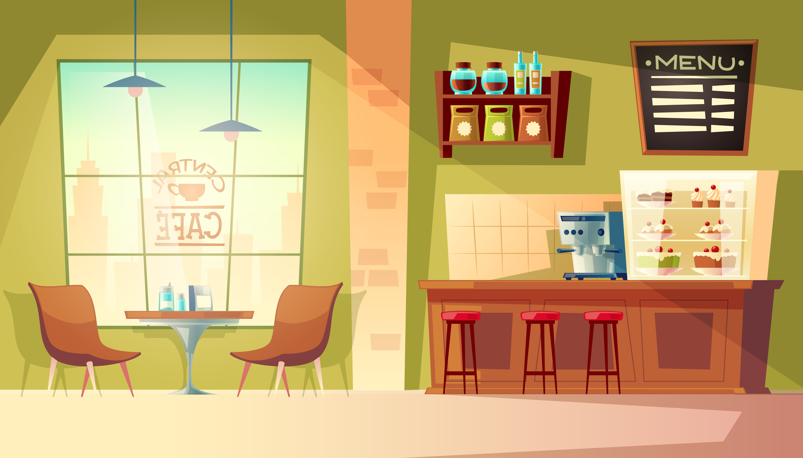

# Cafeteria Konecta 

<p align="right">
  
</p>


## Objetivos del Proyecto

- Construir una aplicacion que permita gestionar productos y ventas de la cafetería en la sede de Konecta.
- Registrar, editar, eliminar y modificar los productos de la cafetería.
- Registrar ventas de los productos existentes y descontar la cantidad vendida del stock.
- Validar si existe stock para permitir realizar ventas sobre un producto.
- Realizar una consulta directa que permita saber cual es el producto con mayor stock. 
- Realizar una consulta directa que permita saber cual es el producto más vendido. 
***


## Inicialización

1. Descargar o clonar el proyecto en la carpeta htdocs de xampp 
    - NOTA: poner a la carpeta del proyecto el nombre de "cafeteria"
2. Ingresar a mySql y crear la base de datos, preferiblemente con nombre "cafeteria"
3. Crear las tablas y relaciones de la base de datos introduciendo en mySql el script indicado en la siguiente ruta:
    - /htdocs/cafeteria/application/sql/create_db.sql
4. Se debe ingresar a la siguiente ruta y cambiar los datos con los que se tenga configurada la base de datos:
    - /htdocs/cafeteria/application/controller.php
    - Allí debe cambiar el host, user, password y nombre de la base de datos con los que se tenga configurados en mySql.
```
    private $DB_HOST = "127.0.0.1";
    private $DB_USER = "root";
    private $DB_PASS = "";
    private $DB_NAME = "cafeteria";
```
5. Cuando se cargue la pagina se debe dirigir a la opcion del navBar de crear producto para empezar a llenar la base de datos.
6. IMPORTANTE: Los script para las consultas directas a la Base de datos estan en la siguiente ruta:
    - /htdocs/cafeteria/application/sql/querys.sql
    - Allí se encuentran los 2 puntos solicitados en el enunciado de la prueba

## Despliegue
